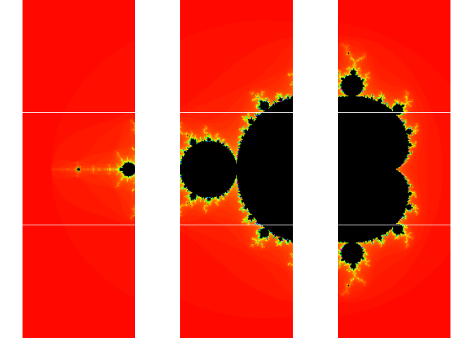

future README.md walkthrough
================

Going through README for the future package located here:
<https://github.com/HenrikBengtsson/future> Most of this is directly
from that document, with occasional personal notes added to help
remember things.

### Intro

A *future* is an abstraction for a value that may be available at some
point in the future. It’s state can be either *resolved* (the value is
available instantaneously) or *unresolved* (*blocks* the current
process)

``` r
library("future")
```

    ## Warning: package 'future' was built under R version 4.0.3

Base:

``` r
v <- {
  cat("Hello world!\n")
  3.14
}
```

    ## Hello world!

``` r
v
```

    ## [1] 3.14

With future:

``` r
v %<-% {
  cat("Hello world!\n")
  3.14
}
v
```

    ## Hello world!

    ## [1] 3.14

**“So why are futures useful? Because we can choose to evaluate the
future expression in a separate R process asynchronously by simply
switching settings as:”**

``` r
plan(multisession)
v %<-% {
  cat("Hello world!\n")
  3.14
}
v
```

    ## Hello world!

    ## [1] 3.14

“With asynchronous futures, the current/main R process does not block,
which means it is available for further processing while the futures are
being resolved in separate processes running in the background. In other
words, futures provide a simple but yet powerful construct for parallel
and / or distributed processing in R.”

### Implicit or Explicit Futures

Above is implicit because it has `v %<-% {expr}` (creates a future and a
promise to its value) and below is explicit because it has `f <-
future({expr})` (creates a future) and `v <- value(f)` (gets the value
of the future, blocks if not resolved)

``` r
f <- future({
 cat("Hello world!\n")
 3.14
})
v <- value(f)
```

    ## Hello world!

``` r
v
```

    ## [1] 3.14

### Controlling How Futures are Resolved

The future package implements the following types of futures:

| Name            | OSes                    | Description                                                      |
| :-------------- | :---------------------- | :--------------------------------------------------------------- |
| *synchronous:*  |                         | *non-parallel:*                                                  |
| `sequential`    | all                     | sequentially and in the current R process                        |
| `transparent`   | all                     | as sequential w/ early signaling and w/out local (for debugging) |
| *asynchronous:* |                         | *parallel*:                                                      |
| `multisession`  | all                     | background R sessions (on current machine)                       |
| `multicore`     | not Windows/not RStudio | forked R processes (on current machine)                          |
| `cluster`       | all                     | external R sessions on current, local, and/or remote machines    |
| `remote`        | all                     | Simple access to remote R sessions                               |

### Consistent Behavior Across Futures

  - All evaluation is done in a local environment **what does this
    mean?**
  - “When a future is constructed global variabls are identified. For
    asynchronous evaluation, globals are exported to the R
    process/session that will be evaluating the future expression. For
    sequential futures with lazy evaluation (lazy = TRUE), globals
    are”frozen" (cloned to a local environment of the future)"
  - Future expressions are evaluated only once.

<!-- end list -->

``` r
plan(sequential)
a <- 1
x %<-% {
   a <- 2
   2 * a
}
x
```

    ## [1] 4

``` r
a
```

    ## [1] 1

The value for x is 4 but the value for a is 1 because the assignment of
`2 <- a` is only true within the brackets

### Synchronous Futures

#### Sequential

default. supposed to behave as similar as possible to regular R
evaluation

``` r
plan(sequential)
pid <- Sys.getpid()
pid
```

    ## [1] 3124

``` r
a %<-% {
   pid <- Sys.getpid()
   cat("Future 'a' ...\n")
   3.14
}

b %<-% {
   rm(pid)
   cat("Future 'b' ...\n")
   Sys.getpid()
}

c %<-% {
   cat("Future 'c' ...\n")
   2 * a
}
```

    ## Future 'a' ...

``` r
b
```

    ## Future 'b' ...

    ## Warning in rm(pid): object 'pid' not found

    ## [1] 3124

``` r
c
```

    ## Future 'c' ...

    ## [1] 6.28

``` r
a
```

    ## [1] 3.14

``` r
pid
```

    ## [1] 3124

**confused. Didn’t quite work correctly based on example** (because
`Object 'pid' not found` error)

#### Transparent

Good for troubleshooting

``` r
plan(transparent)
pid <- Sys.getpid()
pid

a %<-% {
   pid <- Sys.getpid()
   cat("Future 'a' ...\n")
   3.14
}

b %<-% {
   rm(pid)
   cat("Future 'b' ...\n")
   Sys.getpid()
}

c %<-% {
   cat("Future 'c' ...\n")
   2 * a
}

b
c
a
pid
```

**couldn’t find anything for why this is happening… more confused**

### Asynchronous Futures

futures that are resolved in the background. non-blocking by design but
if the calling process tries to access the value and it’s not yet
resolved then it blocks.

#### Multisession Futures

evaluated in the background on the same machine as the calling process.

``` r
plan(multisession)
pid <- Sys.getpid()
pid
```

    ## [1] 3124

``` r
a %<-% {
   pid <- Sys.getpid()
   cat("Future 'a' ...\n")
   3.14
}

b %<-% {
   rm(pid)
   cat("Future 'b' ...\n")
   Sys.getpid()
}

c %<-% {
   cat("Future 'c' ...\n")
   2 * a
}
```

    ## Future 'a' ...

``` r
b
```

    ## Future 'b' ...

    ## Warning in rm(pid): object 'pid' not found

    ## [1] 2544

``` r
c
```

    ## Future 'c' ...

    ## [1] 6.28

``` r
a
```

    ## [1] 3.14

``` r
pid
```

    ## [1] 3124

Still giving the same error about pid. I wonder if it’s just an error bc
I’m in markdown?

Regardless you can see that the pid is 8444 for b instead of 3784

#### Multicore Futures

Doesn’t work on windows.

#### Cluster Futures

“evalue expressions on an ad-hoc cluster (as implemented by the parallel
package)” ad hoc = on the spot

``` r
# cl <- parallel::makeCluster(c("n1", "n2", "n3"))
# plan(cluster, workers = cl)
# pid <- Sys.getpid()
# pid
# 
# a %<-% {
#    pid <- Sys.getpid()
#    cat("Future 'a' ...\n")
#    3.14
# }
# 
# b %<-% {
#    rm(pid)
#    cat("Future 'b' ...\n")
#    Sys.getpid()
# }
# 
# c %<-% {
#    cat("Future 'c' ...\n")
#    2 * a
# }
# 
# b
# c
# a
# pid
# parallel::stopCluster(cl)
```

Need to see \`help(“makeCluster”, package = “parallel”) to figure out
cluster portion. Not important at the moment.

#### Nested Futures and Evaluation Topologies

“This far we have discussed what can be referred to as”flat topology" of
futures, that is, all futures are created in and assigned to the same
environment. However, there is nothing stopping us from using a “nested
topology” of futures, **where one set of futures may, in turn, create
another set of futures internally and so on."**

``` r
plan(multisession)
pid <- Sys.getpid()
a %<-% {
   cat("Future 'a' ...\n")
   Sys.getpid()
}
b %<-% {
   cat("Future 'b' ...\n")
   b1 %<-% {
       cat("Future 'b1' ...\n")
       Sys.getpid()
   }
   b2 %<-% {
       cat("Future 'b2' ...\n")
       Sys.getpid()
   }
   c(b.pid = Sys.getpid(), b1.pid = b1, b2.pid = b2)
}
pid
```

    ## [1] 3124

``` r
a
```

    ## Future 'a' ...

    ## [1] 3404

``` r
b
```

    ## Future 'b' ...
    ## Future 'b1' ...
    ## Future 'b2' ...

    ##  b.pid b1.pid b2.pid 
    ##  10360  10360  10360

Note that the pid for all of the bs is the same because nested futures
use sequential evaluation unless otherwise specified.

To flip the order you have to say it explicitly like
`plan(list(sequential, multisession))`. The last one explicitly would
look like this: `plan(list(multisession, sequential))` but it’s the
default so there’s no need to type it that way.

``` r
plan(list(sequential,multisession))
pid <- Sys.getpid()
a %<-% {
   cat("Future 'a' ...\n")
   Sys.getpid()
}
b %<-% {
   cat("Future 'b' ...\n")
   b1 %<-% {
       cat("Future 'b1' ...\n")
       Sys.getpid()
   }
   b2 %<-% {
       cat("Future 'b2' ...\n")
       Sys.getpid()
   }
   c(b.pid = Sys.getpid(), b1.pid = b1, b2.pid = b2)
}
pid
```

    ## [1] 3124

``` r
a
```

    ## Future 'a' ...

    ## [1] 3124

``` r
b
```

    ## Future 'b' ...
    ## Future 'b1' ...
    ## Future 'b2' ...

    ##  b.pid b1.pid b2.pid 
    ##   3124  10252  13440

You also can force it to use nested multisessions, but that seems like a
bad idea when just starting out.

### Checking a Future Without Blocking

different based on whether the future is explicit or implicit, but you
can use `f <- futureOf(a)` to retrieve the explicit part of an implicit
future

``` r
plan(multisession)
a %<-% {
   cat("Future 'a' ...")
   Sys.sleep(2)
   cat("done\n")
   Sys.getpid()
}
cat("Waiting for 'a' to be resolved ...\n")
```

    ## Waiting for 'a' to be resolved ...

``` r
f <- futureOf(a)
count <- 1
while (!resolved(f)) {
   cat(count, "\n")
   Sys.sleep(0.2)
   count <- count + 1
}
```

    ## 1 
    ## 2 
    ## 3

``` r
cat("Waiting for 'a' to be resolved ... DONE\n")
```

    ## Waiting for 'a' to be resolved ... DONE

``` r
a
```

    ## Future 'a' ...done

    ## [1] 5980

### Failed Futures

If an error occurs while evaluating a future it propagates and is thrown
as an error in the calling environment **when the future value is
requested**

Past that I’m a little confused. It has to do with limitations of
`tryCatch()` within the package.

### Globals

Issues arise when global objects aren’t passed in the correct instance
to the evaluator when the future is resolved. They try to work around
this by using the globals package but it can still cause problems. You
can manually specify the global variables if necessary by `globals =
c("a", "slow_sum")` or `globals = list(a = 42, slow_sum = my_sum)`

### Constraints when using Implicit Futures

An explicit future can be assigned anywhere to anything. An implicit one
cannot because the `%<-%` operator can only be used to assign future
values to environments.

### Demos

``` r
plan(sequential)
demo("mandelbrot", package="future", ask = FALSE)
```

    ## 
    ## 
    ##  demo(mandelbrot)
    ##  ---- ~~~~~~~~~~
    ## 
    ## > library("future")
    ## 
    ## > library("graphics")
    ## 
    ## > plot_what_is_done <- function(counts) {
    ## +   for (kk in seq_along(counts)) {
    ## +     f <- counts[[kk]]
    ## + 
    ## +     ## Already plotted?
    ## +     if (!inherits(f, "Future")) next
    ## + 
    ## +     ## Not resolved?
    ## +     if (!resolved(f)) next
    ## + 
    ## +     message(sprintf("Plotting tile #%d of %d ...", kk, n))
    ## +     counts[[kk]] <- value(f)
    ## +     screen(kk)
    ## +     plot(counts[[kk]])
    ## +   }
    ## + 
    ## +   counts
    ## + }
    ## 
    ## > ## Options
    ## > region <- getOption("future.demo.mandelbrot.region", 1L)
    ## 
    ## > if (!is.list(region)) {
    ## +   if (region == 1L) {
    ## +     region <- list(xmid = -0.75, ymid = 0.0, side = 3.0)
    ## +   } else if (region == 2L) {
    ## +     region <- list(xmid = 0.283, ymid = -0.0095, side = 0.00026)
    ## +   } else if (region == 3L) {
    ## +     region <- list(xmid = 0.282989, ymid = -0.01, side = 3e-8)
    ## +   }
    ## + }
    ## 
    ## > nrow <- getOption("future.demo.mandelbrot.nrow", 3L)
    ## 
    ## > resolution <- getOption("future.demo.mandelbrot.resolution", 400L)
    ## 
    ## > delay <- getOption("future.demo.mandelbrot.delay", interactive())
    ## 
    ## > if (isTRUE(delay)) {
    ## +   delay <- function(counts) Sys.sleep(1.0)
    ## + } else if (!is.function(delay)) {
    ## +   delay <- function(counts) {}
    ## + }
    ## 
    ## > ## Generate Mandelbrot tiles to be computed
    ## > Cs <- mandelbrot_tiles(xmid = region$xmid, ymid = region$ymid,
    ## +                        side = region$side, nrow = nrow,
    ## +                        resolution = resolution)
    ## 
    ## > if (interactive()) {
    ## +   dev.new()
    ## +   plot.new()
    ## +   split.screen(dim(Cs))
    ## +   for (ii in seq_along(Cs)) {
    ## +     screen(ii)
    ## +     par(mar = c(0, 0, 0, 0))
    ## +     text(x = 1 / 2, y = 1 / 2, sprintf("Future #%d\nunresolved", ii), cex = 2)
    ## +   }
    ## + } else {
    ## +   split.screen(dim(Cs))
    ## + }

    ## [1] 1 2 3 4 5 6 7 8 9
    ## 
    ## > ## Create all Mandelbrot tiles via lazy futures
    ## > n <- length(Cs)
    ## 
    ## > message(sprintf("Creating %d Mandelbrot tiles:", n), appendLF = FALSE)

    ## Creating 9 Mandelbrot tiles:

    ## 
    ## > counts <- lapply(seq_along(Cs), FUN=function(ii) {
    ## +   message(" ", ii, appendLF = FALSE)
    ## +   C <- Cs[[ii]]
    ## +   future({
    ## +     message(sprintf("Calculating tile #%d of %d ...", ii, n), appendLF = FALSE)
    ## +     fit <- mandelbrot(C)
    ## + 
    ## +     ## Emulate slowness
    ## +     delay(fit)
    ## + 
    ## +     message(" done")
    ## +     fit
    ## +   }, lazy = TRUE)
    ## + })

    ## 1 2 3 4 5 6 7 8 9

    ## 
    ## > message(".")

    ## .

    ## 
    ## > ## Calculate and plot tiles
    ## > repeat {
    ## +   counts <- plot_what_is_done(counts)
    ## +   if (!any(sapply(counts, FUN = inherits, "Future"))) break
    ## + }

    ## Plotting tile #1 of 9 ...
    ## Calculating tile #1 of 9 ... done
    ## Plotting tile #2 of 9 ...
    ## Calculating tile #2 of 9 ... done
    ## Plotting tile #3 of 9 ...
    ## Calculating tile #3 of 9 ... done
    ## Plotting tile #4 of 9 ...
    ## Calculating tile #4 of 9 ... done
    ## Plotting tile #5 of 9 ...
    ## Calculating tile #5 of 9 ... done
    ## Plotting tile #6 of 9 ...
    ## Calculating tile #6 of 9 ... done
    ## Plotting tile #7 of 9 ...
    ## Calculating tile #7 of 9 ... done
    ## Plotting tile #8 of 9 ...
    ## Calculating tile #8 of 9 ... done
    ## Plotting tile #9 of 9 ...
    ## Calculating tile #9 of 9 ... done

    ## 
    ## > close.screen()
    ## [1] 1 2 3 4 5 6 7 8 9
    ## 
    ## > message("SUGGESTION: Try to rerun this demo after changing strategy for how futures are resolved, e.g. plan(multisession).\n")

    ## SUGGESTION: Try to rerun this demo after changing strategy for how futures are resolved, e.g. plan(multisession).

<!-- -->

``` r
plan(multisession)
demo("mandelbrot", package="future", ask = FALSE)
```

    ## 
    ## 
    ##  demo(mandelbrot)
    ##  ---- ~~~~~~~~~~
    ## 
    ## > library("future")
    ## 
    ## > library("graphics")
    ## 
    ## > plot_what_is_done <- function(counts) {
    ## +   for (kk in seq_along(counts)) {
    ## +     f <- counts[[kk]]
    ## + 
    ## +     ## Already plotted?
    ## +     if (!inherits(f, "Future")) next
    ## + 
    ## +     ## Not resolved?
    ## +     if (!resolved(f)) next
    ## + 
    ## +     message(sprintf("Plotting tile #%d of %d ...", kk, n))
    ## +     counts[[kk]] <- value(f)
    ## +     screen(kk)
    ## +     plot(counts[[kk]])
    ## +   }
    ## + 
    ## +   counts
    ## + }
    ## 
    ## > ## Options
    ## > region <- getOption("future.demo.mandelbrot.region", 1L)
    ## 
    ## > if (!is.list(region)) {
    ## +   if (region == 1L) {
    ## +     region <- list(xmid = -0.75, ymid = 0.0, side = 3.0)
    ## +   } else if (region == 2L) {
    ## +     region <- list(xmid = 0.283, ymid = -0.0095, side = 0.00026)
    ## +   } else if (region == 3L) {
    ## +     region <- list(xmid = 0.282989, ymid = -0.01, side = 3e-8)
    ## +   }
    ## + }
    ## 
    ## > nrow <- getOption("future.demo.mandelbrot.nrow", 3L)
    ## 
    ## > resolution <- getOption("future.demo.mandelbrot.resolution", 400L)
    ## 
    ## > delay <- getOption("future.demo.mandelbrot.delay", interactive())
    ## 
    ## > if (isTRUE(delay)) {
    ## +   delay <- function(counts) Sys.sleep(1.0)
    ## + } else if (!is.function(delay)) {
    ## +   delay <- function(counts) {}
    ## + }
    ## 
    ## > ## Generate Mandelbrot tiles to be computed
    ## > Cs <- mandelbrot_tiles(xmid = region$xmid, ymid = region$ymid,
    ## +                        side = region$side, nrow = nrow,
    ## +                        resolution = resolution)
    ## 
    ## > if (interactive()) {
    ## +   dev.new()
    ## +   plot.new()
    ## +   split.screen(dim(Cs))
    ## +   for (ii in seq_along(Cs)) {
    ## +     screen(ii)
    ## +     par(mar = c(0, 0, 0, 0))
    ## +     text(x = 1 / 2, y = 1 / 2, sprintf("Future #%d\nunresolved", ii), cex = 2)
    ## +   }
    ## + } else {
    ## +   split.screen(dim(Cs))
    ## + }

    ## Warning in par(new = TRUE): calling par(new=TRUE) with no plot

    ## [1] 10 11 12 13 14 15 16 17 18
    ## 
    ## > ## Create all Mandelbrot tiles via lazy futures
    ## > n <- length(Cs)
    ## 
    ## > message(sprintf("Creating %d Mandelbrot tiles:", n), appendLF = FALSE)

    ## Creating 9 Mandelbrot tiles:

    ## 
    ## > counts <- lapply(seq_along(Cs), FUN=function(ii) {
    ## +   message(" ", ii, appendLF = FALSE)
    ## +   C <- Cs[[ii]]
    ## +   future({
    ## +     message(sprintf("Calculating tile #%d of %d ...", ii, n), appendLF = FALSE)
    ## +     fit <- mandelbrot(C)
    ## + 
    ## +     ## Emulate slowness
    ## +     delay(fit)
    ## + 
    ## +     message(" done")
    ## +     fit
    ## +   }, lazy = TRUE)
    ## + })

    ## 1 2 3 4 5 6 7 8 9

    ## 
    ## > message(".")

    ## .

    ## 
    ## > ## Calculate and plot tiles
    ## > repeat {
    ## +   counts <- plot_what_is_done(counts)
    ## +   if (!any(sapply(counts, FUN = inherits, "Future"))) break
    ## + }

    ## Plotting tile #1 of 9 ...
    ## Calculating tile #1 of 9 ... done
    ## Plotting tile #2 of 9 ...
    ## Calculating tile #2 of 9 ... done
    ## Plotting tile #3 of 9 ...
    ## Calculating tile #3 of 9 ... done
    ## Plotting tile #4 of 9 ...
    ## Calculating tile #4 of 9 ... done
    ## Plotting tile #5 of 9 ...
    ## Calculating tile #5 of 9 ... done
    ## Plotting tile #6 of 9 ...
    ## Calculating tile #6 of 9 ... done
    ## Plotting tile #7 of 9 ...
    ## Calculating tile #7 of 9 ... done
    ## Plotting tile #8 of 9 ...
    ## Calculating tile #8 of 9 ... done
    ## Plotting tile #9 of 9 ...
    ## Calculating tile #9 of 9 ... done

    ## 
    ## > close.screen()
    ##  [1]  1  2  3  4  5  6  7  8  9 10 11 12 13 14 15 16 17 18
    ## 
    ## > message("SUGGESTION: Try to rerun this demo after changing strategy for how futures are resolved, e.g. plan(multisession).\n")

    ## SUGGESTION: Try to rerun this demo after changing strategy for how futures are resolved, e.g. plan(multisession).

<!-- -->

They look the same. I’m unsure if that’s the point.
