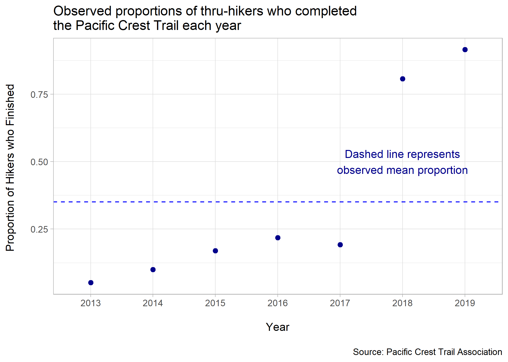
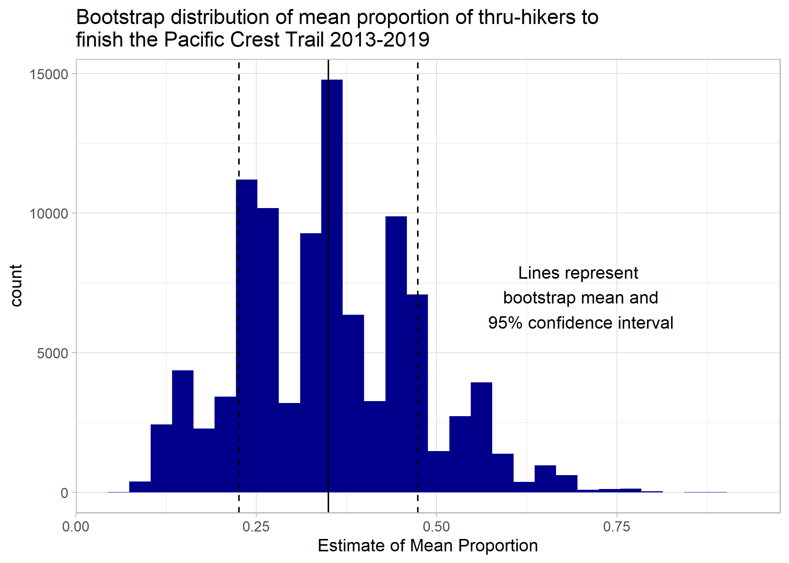
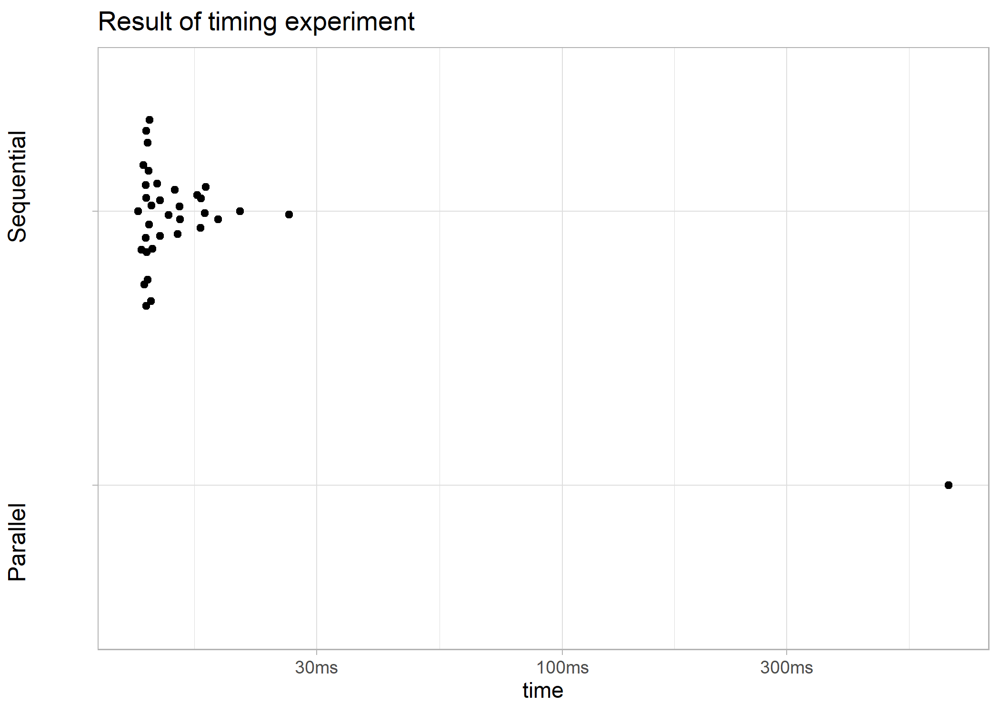

```{r setup, include=FALSE}
knitr::opts_chunk$set(echo = TRUE)
library(here)
library(png)
```

# 2650 Miles: Bootstrapping the Pacific Crest Trail in Parallel

## Ericka Smith

## Fall 2020

### Executive Summary

Bootstrapping methods were combined with parallel computing to produce an estimate for the mean proportion of thru-hikers who complete the Pacific Crest Trail each year. The estimated proportion of finishers was determined to be 0.349 (n=7) and use of future and furrr to connect to Amazon Elastic Compute Cloud (Amazon EC2) was successful. 

### Introduction

The Pacific Crest Trail is a hiking path that runs from the southern border of the U.S. with Mexico to the northern border with Canada. It lies along the west coast and approximately follows the crest of the Sierra Nevada and the Cascade Mountains. The trail is estimated to be 2650 miles long and is an extreme feat to complete, taking upwards of five months, thousands of dollars, and the ability to stay safe in dangerous backcountry conditions. 

There is little data collected in general about this endeavor, and none on how likely a given thru-hiker (the term for those hikers that attempt 500 or more miles) is to successfully finish the entire trail. Much of has been collected by the Pacific Crest Trail Association through their 2,600 miler list. This is entirely self reported. It spans back to 1951, but information from the U.S. Forest Service on the number of permits issued each year has only been consistently kept since 2013 due to changes in permitting. Through use of this data this project aimed to estimate the proportion of hikers who complete the trail each year. 

```{r echo=FALSE, out.width="75%", fig.align="center"}

```

### Methodology

The method of estimation for this investigation was bootstrapping. Though computations were relatively efficient, as there are only seven data points (2013-2019), a primary goal was to gain experience using parallel computing. This was done using the socket method of parallelization to create a cluster with Amazon EC2. The furrr package (a sort of "combo" of future and purrr) was also an integral part.

This analysis began with completion of multiple vignettes and tutorials, which are all included in the `doc` folder. Then the bootstrapping was initially created using non-parallel methods (see `analysis/01_initial-boostrap-run.md`). This was used as a template to create the same analysis in a modular format, which includes `02_data-cleaning.md`, `03_run-bootstrap.md`, and  |             `04_make-summary-plots-and-table.md`, all in the `analysis` folder. 

Next a parallel socket cluster was created on Amazon Elastic Compute Cloud (Amazon EC2), via the resources in `doc/setup_aws_ec2_instance_with_Rstudio.md`. This specific task comprised the majority of the time spent on the project. Finally, the bootstrap code was modified to be in parallel, which can be found in `analysis/05_run-bootstrap-parallel.md`. This specific task required the recreation of functions in `R/boostrap-functions.R` due to minor inconsistencies between the furrr and purrr packages. Documentation for functions was completed and can be found in the `man` folder.

In addition, a timing experiment was run to examine any differences in efficiency between the parallel and nonparallel versions of the analysis, and this can be found in `analysis/06_timing-experiment.md`.

### Results

The estimated mean proportion of thru-hikers determined from this project is 0.3494216, with a 95% confidence interval of (0.2255479, 0.4732954), which matches reasonably with the observed mean of 0.3501639

However, the bootstrap distribution (below) does not appear to be approximately normal. 

```{r echo=FALSE, out.width="75%", fig.align="center"}

```

Most importantly, the parallel approach was not faster, as you can see in the timing plot below. This makes intuitive sense because parallelization is more advantageous when there is a lot of computation involved, which in this case there is not. Even with 100,000 resamples we still are only resampling a vector of seven numbers.

```{r echo=FALSE, out.width="75%", fig.align="center"}

```

### Discussion

Due to the small sample size (n=7) and the shape of the bootstrap distribution these results should be taken with ample reservations. Additionally, the raw data shows a marked increase in proportion of finishers in 2017. This could be due to a number of things. Higher success could simply be due to an increase in reporting. It also could be due to a true increase in success in light of advance safety technology and planning resources. But this report will not attempt to guess at the cause, rather, it suggests further inquiry. 

Though any conclusions of this study are shaky at best, due to the limitations just discussed, the goals of the project were met. The primary motivation of gaining experience and knowledge in parallel computing was a success. I gained understanding of the future and furrr packages. I also learned what a parallel socket cluster is and used Amazon EC2 to complete the bootstrapping. Additionally, despite a setback trying to learn how to use the liftr package, I did gain a lot of experience with best practices for repository structure, an introduction to documentation via roxygen, and practice using the testthat package. Finally, an estimate of the mean proportion of PCT trail finishers was estimated. Overall this project was a success. 

### Supplementary Material

Please see the project repository at [https://github.com/ST541-Fall2020/erickabsmith-project-trail](https://github.com/ST541-Fall2020/erickabsmith-project-trail) for sources used (`CITATION.md`) and further information (`README.md`)
