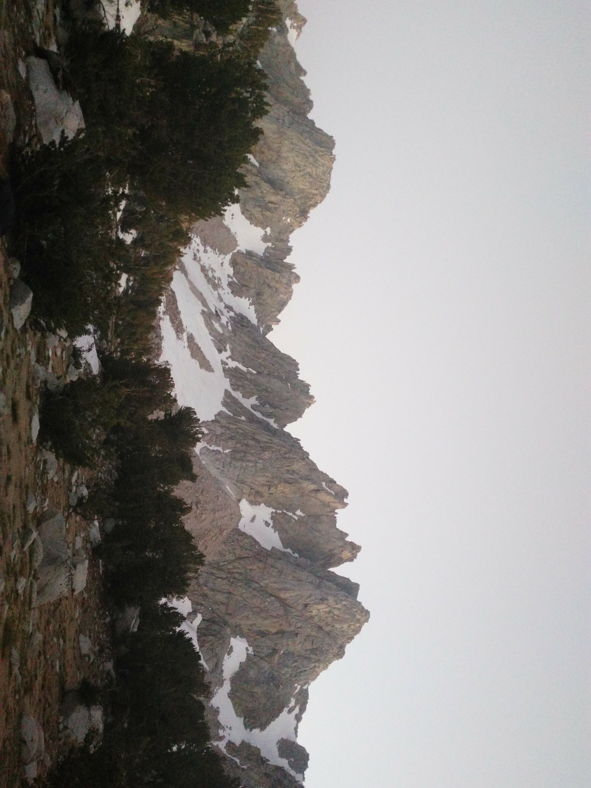
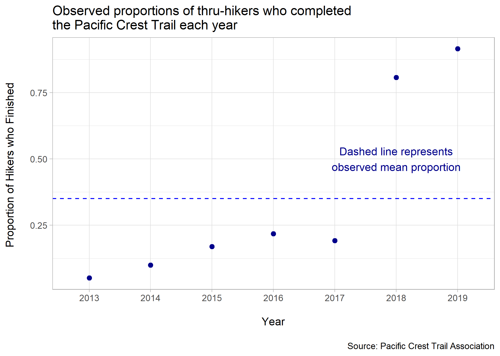
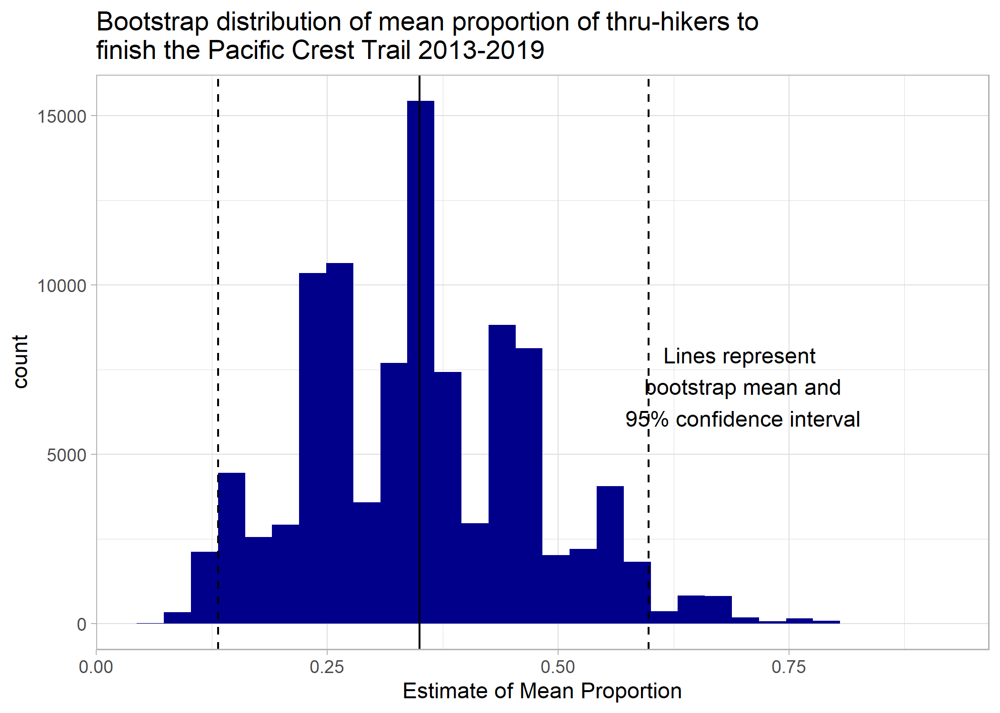
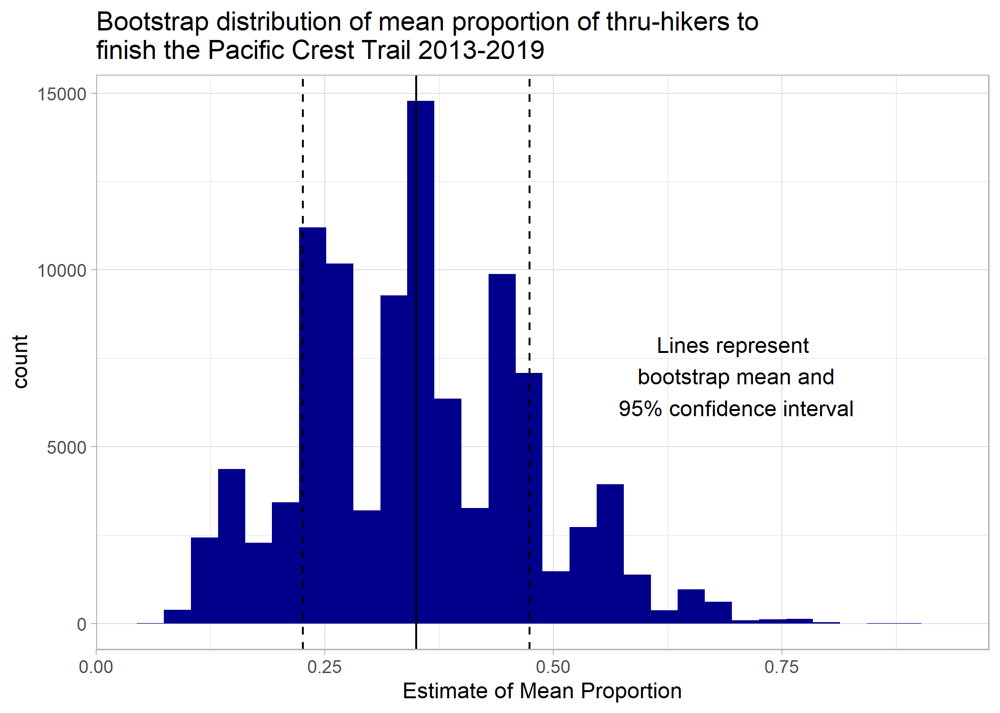
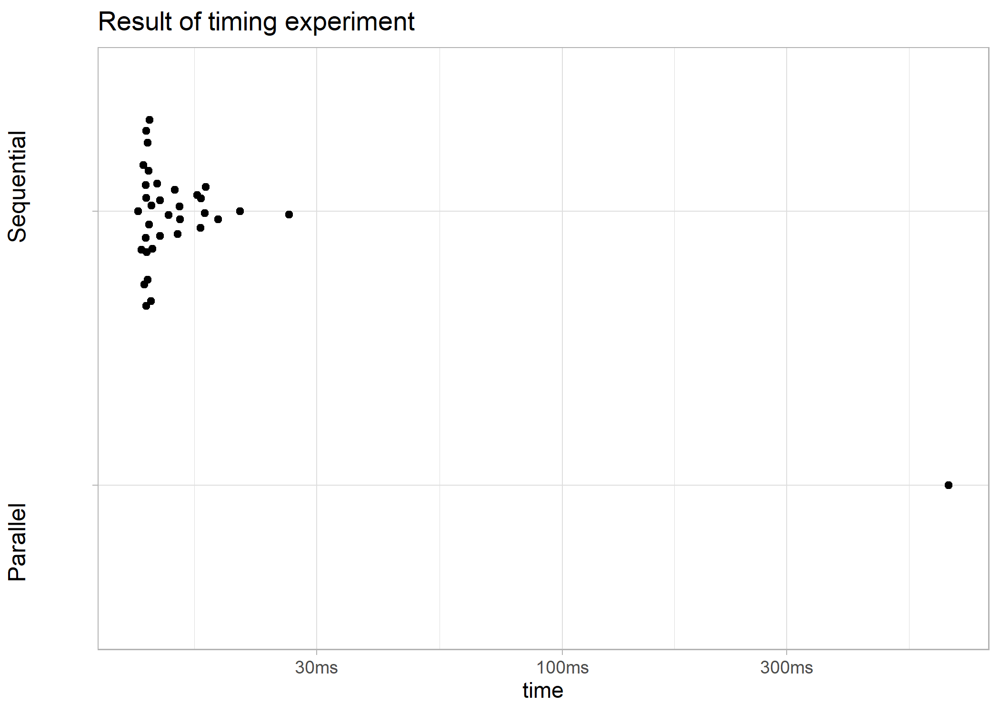

## Bootstrapping the Pacific Crest Trail in Parallel

Bootstrapping methods were combined with parallel computing to produce an estimate for the mean proportion of thru-hikers who complete the Pacific Crest Trail*  (PCT) each year. The estimated proportion of finishers was determined to be 0.349 (n=7). Then a timing test was run to compare between the parallel processing workflow (Amazon Elastic Compute Cloud/Amazon Web Services and socket method) and a local, sequential, workflow to see which most efficiently managed this bootstrap resampling.

#### A look at the raw data:

As is clear from this plot, there are many limitations to these analyses. 
1. Small sample size
2. Self-reported 
3. 2018 and 2019 likely come from a different distribution, violating the i.i.d. assumption of bootstrap resampling.

#### Here's the bootstrap distributions:

The lack of normality makes sense due to the the aforementioned limitations.
Since a primary purpose of this project was to learn about parallel processing I continued on with the analysis despite violation of assumptions.

#### The timing experiment:

This shows a distinct difference between the parallel method and the sequential method. This makes intuitive sense because parallelization is more advantageous when there is a lot of computation involved, which in this case there is not. Even with 100,000 resamples we still are only resampling a vector of seven numbers.

 * What is the Pacific Crest Trail? The Pacific Crest Trail is a hiking path that runs from the southern border of the U.S. with Mexico to the northern border with Canada. It lies along the west coast and approximately follows the crest of the Sierra Nevada and the Cascade Mountains. The trail is estimated to be 2650 miles long and is an extreme feat to complete, taking upwards of five months, thousands of dollars, and the ability to stay safe in dangerous backcountry conditions.

