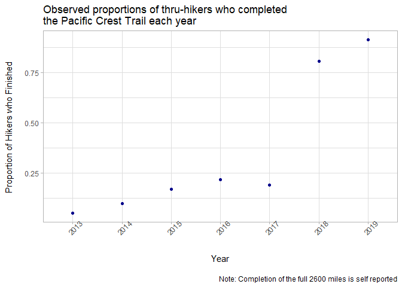
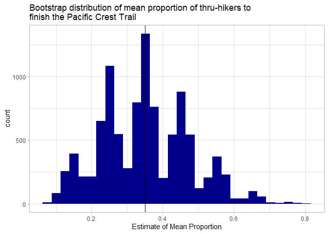

01\_initial-bootstrap-run
================

This file is the “first draft” of this project. It includes the entire
sequential bootstrapping analysis, save for the creation of tables. It
relies on `data/pcta.rds`

``` r
library(tidyverse)
library(here)
library(rsample)
library(ggpubr)
library(magrittr)
library(purrr)
set.seed(171819)
```

``` r
pct_completions <- readRDS(here("data", "pcta.rds"))
pct_completions <- pct_completions %>%
  mutate(prop = completions/(northbound+southbound),
         year = factor(year))
```

## Question of interest: What’s the average proportion of hikers who complete the Pacific Crest Trail?

First, get an idea of the data.

``` r
pct_completions %>% 
  ggplot(aes(x = year, y=prop)) +
  geom_point(color = "darkblue") +
  labs(title = "Observed proportions of thru-hikers who completed \nthe Pacific Crest Trail each year",
       caption = "\nNote: Completion of the full 2600 miles is self reported",
       x = "\nYear",
       y = "Proportion of Hikers who Finished \n")+
  theme_light()+
  theme(axis.text.x = element_text(angle=45))
```

<!-- -->

``` r
(obs_mean <- mean(pct_completions$prop))
```

    ## [1] 0.3501639

Based on the observed sample I estimate the mean proportion of hikers
who finish to be 0.3501639.

Now do bootstrap resamples with `bootstraps`

``` r
resamples <- rsample::bootstraps(pct_completions, times = 10000)
resamples <- resamples %>%
  mutate(mean_prop_completed = map_dbl(splits,~mean(as.data.frame(.)$prop)))
```

Now plot the bootstrap distribution.

``` r
resamples %>% 
  ggplot(aes(x = mean_prop_completed)) +
    geom_histogram(fill = "darkblue") +
    geom_vline(xintercept = obs_mean) +
    labs(title = "Bootstrap distribution of mean proportion of thru-hikers to \nfinish the Pacific Crest Trail",
      x = "Estimate of Mean Proportion")+
  theme_light()
```

    ## `stat_bin()` using `bins = 30`. Pick better value with `binwidth`.

<!-- -->

A 95% confidence interval based on percentile method:

``` r
(ci <- resamples %>% 
  pull(mean_prop_completed) %>% 
  quantile(probs = c(0.025, 0.975)))
```

    ##      2.5%     97.5% 
    ## 0.1290260 0.5971306

With 95% confidence the correlation between the income for husbands and
wives in opposite gender marriages in Oregon in 2016 is between 0.129026
and 0.5971306.
